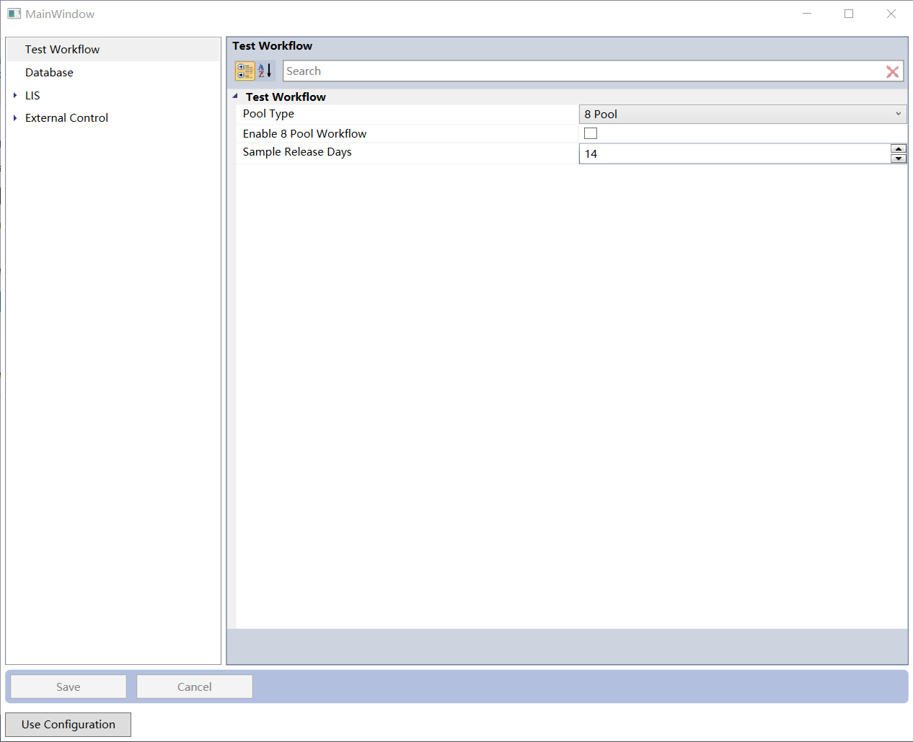

# ConfigurationComplete
ConfigurationComplete is a library for dotnet configuration system based on [WPFToolkit.Extended](https://archive.codeplex.com/?p=wpftoolkit). With this tools, you can easily finish all the operation for configuration, including usage, serialization and GUI. Simple writing class can work with configuration even without knownledge of dotnet configuration. For common window application with GUI, this tool can reduce many coding works on configuration.

# Defination of Configuration Class
Configuration information must inherit from AbstractConfiguration, and all the property must be set with proper attribute
- **ConfigurationPropertyAttribute** required for dotnet configuration system,**required**
- **DisplayNameAttribute** display name of configuration item in PropertyGrid, otional
- **DispIdAttribute** display index of configuration item in PropertyGrid, optional
- **CategoryAttribute** category name of configuration item in PropertyGrid, optional
- **DescriptionAttribute** description of of configuration item in PropertyGrid bottom label, optional
- **DefaultValueAttribute** default value of configuration item in PropertyGrid, optional
- **EditorAttribute** Editor of configuration item in PropertyGrid, optional
- **EnumDisplayNameAttribute** Enum item display name of configuration item in PropertyGrid, optional
- **Other ValidatorAttribute** can be used as in dotnet configuration system, optional

Following is a simple example
```csharp
    [DisplayName("Test Workflow")]
    public class ProcessConfiguration : AbstractConfiguration
    {
        [DispId(0)]
        [Category("Test Workflow")]
        [DisplayName("Pool Type")]
        [Description("Pool Type")]
        [ConfigurationProperty("PoolSize")]
        [DefaultValue(PoolSize.Pool8)]
        public PoolSize PoolSize
        {
            get
            {
                return GetValue<PoolSize>("PoolSize");
            }
            set
            {
                SetValue("PoolSize", value);
                SetPropertyEnabled("IsPool8Enabled", value == PoolSize.Pool8);
            }
        }
        [DispId(1)]
        [Category("Test Workflow")]
        [DisplayName("Enable 8 Pool Workflow")]
        [Description("Enable 8 Pool Workflow")]
        [DefaultValue(false)]
        [ConfigurationProperty("IsPool8Enabled")]
        public bool IsPool8Enabled
        {
            get
            {
                return GetValue<bool>("IsPool8Enabled");
            }
            set
            {
                SetValue("IsPool8Enabled", value);
            }
        }
    }
    public enum PoolSize
    {
        [EnumDisplayName("8 Pool")]
        Pool8,
        [EnumDisplayName("48 Pool")]
        Pool48
    }
```
## Supporting Types
String, boolean, int, float, double, enum and Datetime was tested and supported. More types have to be tested for supporting, currently we have no information.
# Usage
With the function (Save and Load) and property in configuration object, the configuration can be used easily. Please refer to the demo project. 
## Serialization
The default serialization is dotnet Configuration system, all the configuration was save as ConfigurationSection in exe.config file. To save in ini file, please use the IniFileConfigurationSerialization as Serialization property.
Customized IConfigurationSerialization can be defined to serialize configuration to other way, like database.
## Relationship of Configuration
In the Write method of property, you can use SetPropertyEnabled function to disable/enable other property, so user will can not edit the other property.
## Visibilization
The gui of editing configuration is under PropertyGrid of [WPFToolkit.Extended](https://archive.codeplex.com/?p=wpftoolkit)


